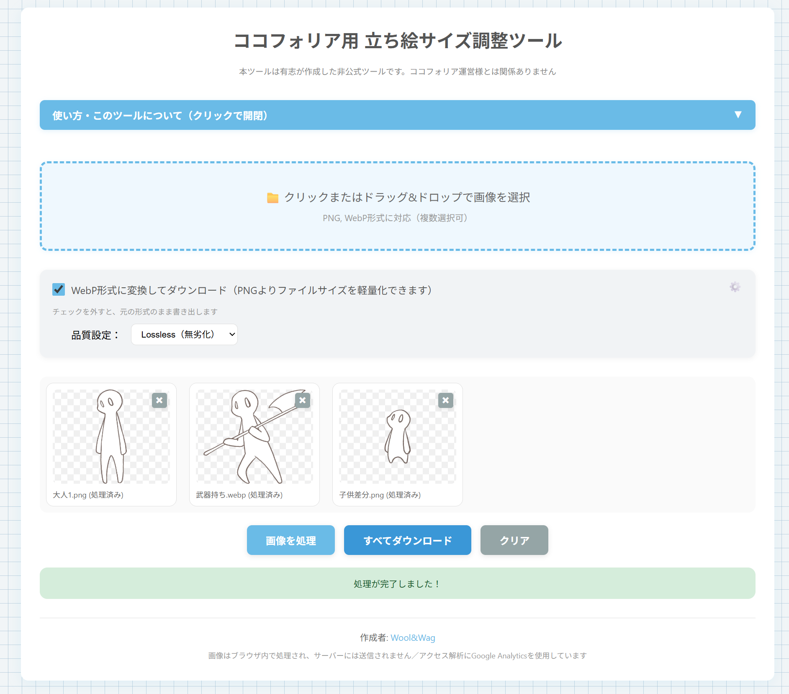

# ココフォリア用 立ち絵サイズ調整ツール

同じキャラの差分立ち絵を、横幅を揃えた画像に変換するツール。
立ち絵を切り替えたときに、コマの画像が急に大きくなったり小さくなったりするのを防ぎます。

**▶ [https://woolwag3338.github.io/character-image-size/](https://woolwag3338.github.io/character-image-size/)**

> 本ツールは有志が作成した**非公式ツール**です。ココフォリア運営とは関係ありません。

インストールは要りません。上のリンクを開いて、立ち絵をドラッグ＆ドロップするだけです。
**画像はブラウザの中だけで処理され、どこにもアップロードされません。**

---

## なぜサイズが変わってしまうのか

ココフォリアでは、画像の**横幅**でコマの画像サイズが決まります。

| 立ち絵 | 横幅 | 結果 |
| --- | --- | --- |
| 通常立ち絵 | 500px | 基準の大きさ |
| 戦闘立ち絵（武器を持っている） | 700px | 通常立ち絵に合わせて縮小され、コマ画像が小さくなる |
| 子供差分 | 300px | 通常立ち絵に合わせて拡大され、コマ画像が大きくなる |

同じキャラクターでも、ポーズや差分によって横幅が違うと、立ち絵を切り替えるたびに
コマ画像の大きさが変わってしまいます。

このツールで横幅を統一しておくと、立ち絵を切り替えても
**コマ画像の大きさが変わらず、身長差やポーズをそのまま維持**できます。

## できること

- **PNG / WebP 画像の読み込み**（複数ファイルをまとめて処理できる）
- **透明部分の自動トリミング**（余白を削除する）
- **横幅の統一**（一番大きい横幅に合わせて、他の画像に左右の余白を足す）
- **WebP への変換**（Lossless／品質指定。ファイルサイズを減らせる）
- **一括ダウンロード**

## 使い方

1. 上のリンクを開く
2. 同じキャラの差分画像（通常・戦闘・子供など）をまとめてドラッグ＆ドロップする
   - クリックしてファイルを選ぶこともできる
3. **「画像を処理」** を押す
   - 透明な余白が削除され、一番横幅が大きい画像に合わせて横幅が揃う
4. **「すべてダウンロード」** を押して保存する

画像を 1 枚だけ入れて、**透明部分のトリミングと軽量化**だけに使うこともできます。

## オプション

| 設定 | 内容 |
| --- | --- |
| WebP形式に変換 | 既定で有効。PNG より軽くなる |
| 品質設定 | `Lossless（無劣化）` が既定。`品質を指定` で 50〜100% を選べる |
| 透明部分をトリミングする | 歯車ボタン（⚙️）の中。切ると元の余白を保つ |
| 横幅を統一する | 歯車ボタン（⚙️）の中。切ると元のサイズを保つ |

下の 2 つは通常そのままで問題ありません。切るとこのツールの目的
（横幅を揃える）を果たさなくなるため、歯車の中に置いてあります。

## 注意

**同じ縮尺で描かれている立ち絵**を前提としています。

子どもを大きいキャンバスで、大人を小さいキャンバスで描いているような場合、
横幅だけ揃えても実際の体格差は狂ってしまいます。

## プライバシー

- **読み込んだ画像はすべてブラウザ内で処理され、どこにもアップロードされません**
- アクセス解析のため [Google Analytics](https://policies.google.com/technologies/partner-sites) を使っています。
  ページの閲覧状況（アクセス日時・参照元・ブラウザの種類など）が Google に送信されますが、
  **画像やファイル名が送信されることはありません**

## 動作環境

- Chrome / Edge / Firefox / Safari の新しめのバージョン
- JavaScript が有効であること
- インストール・アカウント登録は不要

### オフラインで使う

このページの `index.html` を保存すれば、ダブルクリックで開いて使えます。
その場合、アクセス解析の通信も発生しません。

## ライセンス

コードは MIT ライセンスです（→ [LICENSE](LICENSE)）。

**読み込んだ立ち絵や、書き出した画像は本ライセンスの対象外です。**
それらの権利は各権利者に帰属します。

## 作成者

[Wool&Wag](https://x.com/WW_3338)
